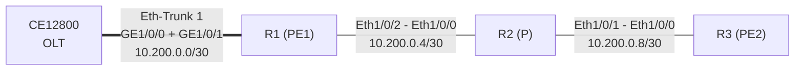
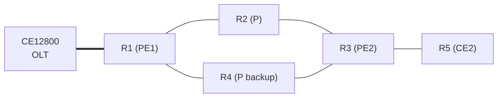
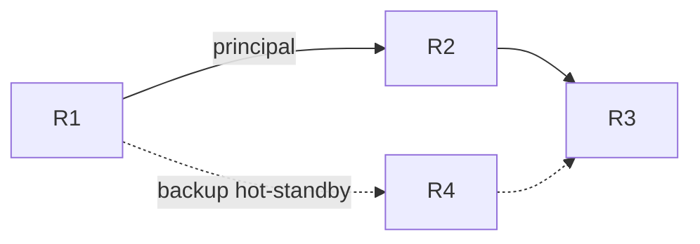

# Topologia

## Física (Lab 1 em andamento)

```mermaid
flowchart LR
    CE["CE12800<br/>OLT"] ===|"Eth-Trunk 1<br/>GE1/0/0 + GE1/0/1<br/>10.200.0.0/30"| R1["R1 (PE1)"]
    R1 ---|"Eth1/0/2 - Eth1/0/0<br/>10.200.0.4/30"| R2["R2 (P)"]
    R2 ---|"Eth1/0/1 - Eth1/0/0<br/>10.200.0.8/30"| R3["R3 (PE2)"]
```

## Final (com R4 e R5)

```mermaid
flowchart LR
    CE["CE12800<br/>OLT"] === R1["R1 (PE1)"]
    R1 --- R2["R2 (P)"] --- R3["R3 (PE2)"]
    R1 --- R4["R4 (P backup)"] --- R3
    R3 --- R5["R5 (CE2)"]
```

## Caminhos de proteção (Lab 5.1)

```mermaid
flowchart LR
    R1["R1"] -->|"principal"| R2["R2"] --> R3["R3"]
    R1 -.->|"backup hot-standby"| R4["R4"] -.-> R3
```
